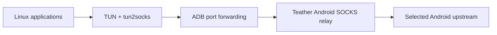
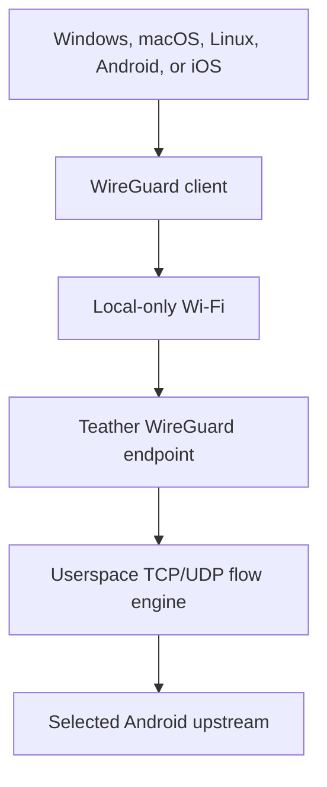

# Teather

Teather is an experimental, unrooted Android-hosted Internet relay for computers,
tablets, and other devices.

The immediate objective is simple: let a Linux computer use an Android phone's
upstream connection through a reliable USB link without enabling Android's stock
tethering service. The longer-term objective is a phone-centered system that can
serve Windows, macOS, Linux, Android, and iOS over Wi-Fi, USB, or Bluetooth with
as little receiver-side software as each platform permits.

> **Status:** P0 passed its physical gates. P1 Linux USB Desktop source and
> host-only checks, both disposable-VM phases, and debug-APK verification are
> complete. The first physical P1 run failed safely at the host DNS-retention
> gate; DNS design review is required before another run.

Teather is currently a personal project. It may later become a public source
repository, but broad distribution, app-store submission, and commercial support
are not current requirements.

> **Codex startup gate:** The first prompt in every new Teather Codex
> conversation is read-only. Codex must recommend GPT-5.6 Sol with **Ultra** or
> **High**, explain the scope classification, and stop before work begins. See
> [AGENTS.md](AGENTS.md#fresh-codex-session-gate). The same stop applies within
> a thread before a materially new phase that needs a High/Ultra change. The
> current P1 DNS design review is an **Ultra** task.

## Why this exists

Android and desktop operating systems already provide ordinary tethering. That
works well when the phone, operating system, and mobile plan all permit the same
path. It becomes less useful when tethering is unavailable, unreliable,
vendor-modified, or only supported by proprietary desktop software.

Teather explores a different arrangement:

- Android runs the relay and opens upstream application sockets.
- A receiver sends its traffic to that relay through a local transport.
- The transport can change without changing the relay's core behavior.
- The first receiver is Linux; cross-platform interoperability is the destination.

Teather does **not** assume that every carrier handles application-relayed traffic
the same way. Behavior must be measured on the owner's connection, and the
project must not promise that usage is unmetered, unclassified, or undetectable.
Users remain responsible for their service agreements and local law.

## Product principles

1. **No root for the baseline.** Teather must not require bootloader unlocking,
   root, system-app privileges, or changes that intentionally compromise Android
   device integrity. Preserving normal Google Wallet/Pay operation is a core
   constraint.
2. **Android is the center.** The phone owns pairing, connection state, upstream
   selection, session metrics, and configuration.
3. **Prove the relay before polishing it.** A plain but dependable tunnel is more
   valuable than a beautiful disconnected button.
4. **One networking core, multiple transports.** USB, Wi-Fi, and Bluetooth are
   adapters around the same authenticated relay protocol.
5. **Receiver software stays thin.** Platform-specific code should capture and
   deliver traffic, not duplicate Android's control logic.
6. **Every network change is reversible.** A crash or unplug must not leave the
   receiver with broken routes, DNS, or firewall state.
7. **Measure; do not mythologize.** Carrier, device, and performance claims must
   be backed by a reproducible experiment recorded in this repository.
8. **Existing receiver links are not Teather's property.** The first Linux
   system-wide mode must leave NetworkManager-managed Wi-Fi and Ethernet
   connections untouched and preferred. The owner decides when to disable or
   restore them.

## Scope

### Baseline goals

- Unrooted Android host.
- System-wide Linux connectivity.
- TCP, UDP, DNS, IPv4, and eventually IPv6.
- USB/ADB as the first development transport.
- Local-only Wi-Fi as the first broadly usable wireless transport.
- Encrypted, mutually authenticated sessions.
- Explicit connection status, data counters, and useful diagnostics.
- Clean suspend, reconnect, disconnect, and route restoration.
- An implementation that can be cloned and built from source.

### Later goals

- Standard WireGuard-compatible receiver connectivity.
- Windows, macOS, Android, and iOS receivers.
- USB Android Open Accessory transport.
- Bluetooth Classic/RFCOMM fallback.
- Existing-LAN and Wi-Fi Direct discovery.
- Multiple saved receiver identities.
- Optional multi-client sessions.

### Non-goals for now

- Root-only routing or Magisk modules.
- Google Play or Apple App Store publication.
- Turnkey support for every Android vendor and Linux distribution.
- Connection bonding, load balancing, or remote cloud relay services.
- A claim that Teather defeats every carrier restriction or accounting method.
- Traffic fingerprint camouflage or carrier-specific "stealth profiles."
- Replacing a normal hotspot when the normal hotspot already meets the need.

## Chosen near-term path

The quickest useful implementation is an Android relay plus a Linux companion
over USB debugging:



The proof of concept deliberately uses replaceable tools:

- **Android:** Kotlin foreground service exposing a local SOCKS5 relay.
- **USB:** `adb forward` between a Linux loopback port and the Android service.
- **Linux:** a non-persistent `teather0` TUN plus an existing `tun2socks`
  implementation.
- **Routing:** a Teather-owned backup default with lower preference than every
  existing physical default; Teather never rewrites or disables those links.
- **First protocol coverage:** IPv4 TCP and tunneled DNS; UDP follows.

The first P1 operating mode is intentionally manual and conservative. With Wi-Fi
or Ethernet present, the existing connection stays preferred. After Teather
passes its own readiness check, the owner may manually disable Wi-Fi; Linux then
uses the remaining `teather0` route. Re-enabling Wi-Fi restores its preferred
route without Teather editing the connection profile. The exact route,
virtual-DNS, privilege, and recovery design is accepted in D-015; live testing
remains gated on isolated verification.

**P1 resolver gate:** tun2proxy virtual DNS uses the host's existing nameserver;
Teather does not configure one. If disabling Wi-Fi leaves no usable non-loopback
IPv4 nameserver, P1 disconnects safely and returns to design review. General UDP and
IPv6 remain unsupported.

ADB is acceptable here because Teather is personal-first and USB debugging is a
reasonable development prerequisite. It lets the project validate the most
important unknown—whether the Android application relay works reliably on the
target phone and connection—before investing in discovery, pairing, packaging,
or a graphical interface.

## Intended long-term path

The long-term design uses Android's local-only hotspot as a local link and runs a
WireGuard-compatible endpoint plus a userspace TCP/IP stack inside Teather:



This remains a hypothesis until a focused prototype proves that the Android
endpoint can terminate and relay realistic TCP/UDP workloads with acceptable
performance and battery use. WireGuard is attractive because mature clients
already exist on all target platforms; it minimizes the number of custom
receivers Teather would need to maintain.

An optional Teather receiver can still provide one-click pairing, ADB/AOA USB,
Bluetooth framing, richer diagnostics, and automatic route management where a
standard WireGuard client cannot.

## Capability progression

| Stage | Link | Receiver setup | Coverage | Purpose |
|---|---|---|---|---|
| P0 — Relay Proof | USB/ADB | Linux script or CLI | Browser TCP | Prove cellular relay |
| P1 — Linux USB Desktop | USB/ADB | Debian GUI, tray, CLI, backup `teather0` | System-wide TCP + DNS after manual link choice | First installable path |
| P2 — Protocol Completeness | USB/ADB | Same Android/Linux applications | TCP + UDP + IPv6 policy | Compatibility and stability |
| P3 — Wireless Relay | Local-only Wi-Fi | Linux companion | Wireless equivalent of P2 | Remove the cable |
| P4 — WireGuard Compatibility | Local-only Wi-Fi | Standard WireGuard client | Cross-platform full tunnel | Universal receiver path |
| P5 — Daily-Driver Experience | Existing transports | Polished Android/desktop control | Proven protocol coverage | Onboarding, history, and recovery polish |
| P6 — Transport Expansion | AOA / Bluetooth / LAN | Thin connector where needed | Transport-dependent | Expand resilience |
| P7 — Platform Expansion | Platform-dependent | Windows/macOS/mobile receivers | Platform-dependent | Expand receiver support |

The table is a sequence, not a release promise. Each stage advances only after
its exit criteria in [the roadmap](docs/ROADMAP.md) are met.

## MVP acceptance criteria

The first viable Linux milestone is complete when all of the following are true:

- A stock, unrooted target Android phone runs the relay for at least two hours.
- Linux reaches the Internet through USB/ADB without enabling stock tethering.
- Browsers, package metadata lookup, Git, SSH, and a DNS test work through the
  system-wide route.
- The session survives transient upstream changes or fails with a clear reason.
- Disconnect, cable removal, application termination, and Linux process failure
  restore the previous route and DNS state.
- Logs are sufficient to distinguish transport, DNS, relay, and upstream failure.
- No secret keys, device identifiers, browsing history, or packet captures are
  committed to the repository.

UDP, IPv6, and Wi-Fi are outside this first acceptance gate. P1 includes a
focused operational GUI; rich history and daily-driver polish are P5.

## Proposed repository shape

The directories below are the intended destination, not all of them exist yet:

```text
Teather/
├── android/                 # Kotlin/Compose host application
├── desktop/
│   ├── linux/               # Initial Linux connector and route manager
│   └── shared/              # Cross-platform receiver code when justified
├── core/                    # Shared protocol/flow engine, language still open
├── docs/
│   ├── ARCHITECTURE.md
│   ├── DECISIONS.md
│   ├── DEVELOPMENT.md
│   ├── EXPERIMENTS.md
│   ├── PROJECT_STATUS.md
│   ├── ROADMAP.md
│   ├── TEST_PLAN.md
│   └── THREAT_MODEL.md
├── tools/                   # Reproducible developer utilities
├── AGENTS.md                # Durable context for coding agents
├── CONTRIBUTING.md
├── SECURITY.md
└── README.md
```

Do not create placeholder source trees merely to match this diagram. Add a
directory when its first real file is ready.

## Documentation map

- [Project status](docs/PROJECT_STATUS.md) — the current milestone, next actions,
  unknowns, and resume point. Read this first when returning after a break.
- [P0 laptop/phone handoff](docs/P0_HANDOFF.md) — exact, placeholder-free commands
  for reproducing the completed P0 experiment with a phone connected through ADB.
- [P1 validation handoff](docs/P1_HANDOFF.md) — the current resume sequence for
  disposable-VM, package/GUI/helper, and physical P1 acceptance gates.
- [P1 offline recovery](docs/P1_RECOVERY.md) — local recovery commands that do
  not depend on Internet or chat access.
- [Architecture](docs/ARCHITECTURE.md) — component boundaries, data flow, and
  technical risks.
- [Roadmap](docs/ROADMAP.md) — ordered milestones and exit criteria.
- [Decision log](docs/DECISIONS.md) — accepted, proposed, and unresolved choices.
- [Development guide](docs/DEVELOPMENT.md) — environment and workflow rules.
- [Experiment log](docs/EXPERIMENTS.md) — reproducible evidence and templates.
- [Test plan](docs/TEST_PLAN.md) — functional, recovery, security, and performance
  validation.
- [Threat model](docs/THREAT_MODEL.md) — assets, boundaries, likely abuse, and
  required mitigations.
- [Contributor guide](CONTRIBUTING.md) — how changes should be proposed and
  documented.
- [Security policy](SECURITY.md) — how to report a vulnerability safely.

## Getting started today

P1 source work, host-only verification, and the disposable Debian 12 GNOME VM
package/GUI/helper/TUN gates are complete. VersionCode 2 / `0.1.0-p1` has a
verified debug signature. D-019 defers a permanent release identity while Teather
is privately tested. During physical validation, package `0.1.0-2` corrected the
user-service PolicyKit launch boundary and connected the bounded tunnel, but
disabling Wi-Fi removed the host's only usable nameserver. Teather disconnected
and restored its state as designed. The next step is the explicit DNS design
review in [the P1 handoff](docs/P1_HANDOFF.md); do not reconnect the phone or
repeat physical acceptance before that review is approved.

The deterministic source-level gate remains:

```bash
make check
```

To reproduce the historical P0 experiment from scratch with an unlocked phone
attached through authorized ADB, run:

```bash
./desktop/linux/teather-p0 doctor
./desktop/linux/teather-p0 all
./desktop/linux/teather-p0 soak
```

The helper discovers the non-sensitive phone and host environment; there are no
device-specific constants to fill into source. See [the P0 handoff](docs/P0_HANDOFF.md)
for its historical physical boundary and evidence procedure. It is not the
current resume point.

## Reference material

- [Android local-only hotspot](https://developer.android.com/develop/connectivity/wifi/localonlyhotspot)
- [Android Wi-Fi Direct](https://developer.android.com/develop/connectivity/wifi/wifi-direct)
- [Android VPN development](https://developer.android.com/develop/connectivity/vpn)
- [Android Open Accessory protocol](https://source.android.com/docs/core/interaction/accessories/protocol)
- [NetworkManager developer documentation](https://networkmanager.dev/docs/developers/)
- [WireGuard installation and platform support](https://www.wireguard.com/install/)
- [Embedding WireGuard](https://www.wireguard.com/embedding/)

## Contributing and licensing

The repository is personal and private at present. Contributions should follow
[CONTRIBUTING.md](CONTRIBUTING.md).

No open-source license has been selected yet. Until a license file is added, the
source is not licensed for redistribution or reuse. Selecting a license is an
explicit pre-publication decision; see [the decision log](docs/DECISIONS.md).
