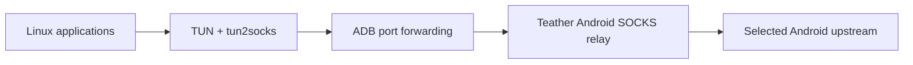
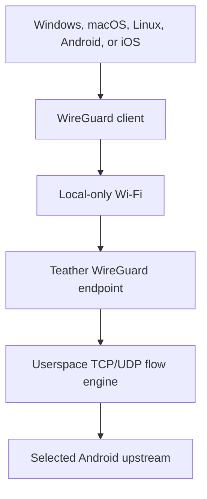

# Teather

Teather is an experimental, unrooted Android-hosted Internet relay for computers,
tablets, and other devices.

The immediate objective is simple: let a Linux computer use an Android phone's
upstream connection through a reliable USB link without enabling Android's stock
tethering service. The longer-term objective is a phone-centered system that can
serve Windows, macOS, Linux, Android, and iOS over Wi-Fi, USB, or Bluetooth with
as little receiver-side software as each platform permits.

> **Status:** P0 passed its physical gates. P1 (Linux USB Desktop) is
> implemented as **D-022** (package `0.1.0-4`): NetworkManager owns the
> non-persistent `teather0` interface, there is no privileged helper, DNS is
> additive so a working Wi-Fi/Ethernet link is never disturbed, and failover to
> the phone is automatic once that link is actually gone. **Validated end to end
> on 2026-08-30** in a disposable VM with the phone passed through over USB —
> real traffic exits on the phone's cellular, failover and restore work
> automatically, teardown returns the host to exact baseline. Remaining before
> P1 sign-off: a two-hour session, the GUI lifecycle, and milestone closeout.
> See `docs/DECISIONS.md` and `docs/P1_HANDOFF.md`.

Teather is currently a personal project. It may later become a public source
repository, but broad distribution, app-store submission, and commercial support
are not current requirements.

> Working on Teather with a coding assistant? `AGENTS.md` has the constraints
> and safety gates; `docs/PROJECT_STATUS.md` is the resume point.

## Why this exists

Mobile carriers commonly meter, surcharge, or throttle tethering separately from
ordinary phone data use — through a paid add-on, a distinct data cap, or
throttling triggered once a connection is classified as a tethered device rather
than the phone itself. Stock tethering/hotspot features are easy for a carrier's
network to classify this way, because a second device's packets are forwarded or
NAT'd through the phone: they typically carry a different OS/TCP fingerprint, an
extra TTL decrement, and a distinct DHCP signature that reveal a second device is
behind the connection.

Teather's actual goal is to use the phone as a full, oversized network interface
for a computer — not a hotspot the computer sits behind, but the computer's
Internet path itself. The Linux computer's applications reach the Internet by way
of the phone's chosen upstream — `teather upstream cellular|wifi|ethernet|auto`
picks which of the phone's transports carries the traffic, switchable without
reconnecting (D-023) — without engaging the phone's stock tethering/hotspot
feature at all.

This works because Teather is architected as an on-device relay, not a
NAT/forwarding gateway:

- Android runs the relay and terminates every connection itself, opening its own
  outbound application socket for each one (D-004).
- A receiver (Linux today) sends its traffic to that relay over a local
  transport; the transport can change without changing the relay's core
  behavior.
- From the carrier network's point of view, the resulting traffic is
  indistinguishable from the phone's own app traffic, because it genuinely is
  the phone's own app traffic — there is no second device's packets being
  forwarded through the phone's IP stack for the network to fingerprint.

That last property is structural, not a built-in evasion feature: it falls out
of choosing an application relay over a NAT/hotspot design, and it is the same
underlying reason earlier tools built for a similar purpose (for example,
PdaNet+) have generally not been classified as tethering by carrier networks.

Teather will not turn this into a guaranteed promise. Carrier detection methods
are outside the application's control, vary by carrier and plan, and change over
time. D-009 records that Teather will not claim universal bypass, unmetered use,
or undetectability, and will not add carrier-specific stealth or
traffic-fingerprint-camouflage features to compensate if a carrier's methods
change — that would make the architecture brittle and the documentation
misleading. What is actually observed on the owner's own connection is measured
and recorded as an experiment (see `docs/EXPERIMENTS.md`), not asserted as a
general property.

This is a personal tool, run on the owner's own device and account, deliberately
operating at the edge of what a tethering-restricted plan permits rather than
outside the law. The owner is solely responsible for reviewing their carrier's
terms of service and applicable law before relying on Teather in place of a paid
tethering feature. Nothing in this repository is legal advice, and using an
application relay this way may violate a carrier's terms of service even where
it is not independently unlawful.

## Product principles

1. **No root for the baseline.** Teather must not require bootloader unlocking,
   root, system-app privileges, or changes that intentionally compromise Android
   device integrity. Preserving normal Google Wallet/Pay operation is a core
   constraint.
2. **Android is the center.** The phone owns pairing, connection state, upstream
   selection, session metrics, and configuration.
3. **Prove the relay before polishing it.** A plain but dependable tunnel is more
   valuable than a beautiful disconnected button.
4. **One networking core, multiple transports.** USB, Wi-Fi, and Bluetooth are
   adapters around the same authenticated relay protocol.
5. **Receiver software stays thin.** Platform-specific code should capture and
   deliver traffic, not duplicate Android's control logic.
6. **Every network change is reversible.** A crash or unplug must not leave the
   receiver with broken routes, DNS, or firewall state.
7. **Measure; do not mythologize.** Carrier, device, and performance claims must
   be backed by a reproducible experiment recorded in this repository.
8. **Existing receiver links are not Teather's property.** The first Linux
   system-wide mode must leave NetworkManager-managed Wi-Fi and Ethernet
   connections untouched and preferred. Teather only takes over automatically
   once such a link is actually gone (a per-user setting can require manual
   confirmation instead).
9. **Prefer the lightest mechanism that meets the milestone's requirement.**
   The phone pays for CPU, battery, and thermal cost, and the desktop client
   should stay cheap at idle. A heavier design (a new background process, a
   full userspace TCP/IP stack, continuous polling) needs measured
   justification recorded as an experiment, not an assumption that it is
   necessary.

## Scope

### Baseline goals

- Unrooted Android host.
- System-wide Linux connectivity.
- TCP, UDP, DNS, IPv4, and eventually IPv6.
- USB/ADB as the first development transport.
- Local-only Wi-Fi as the first broadly usable wireless transport.
- Encrypted, mutually authenticated sessions.
- Explicit connection status, data counters, and useful diagnostics.
- Clean suspend, reconnect, disconnect, and route restoration.
- An implementation that can be cloned and built from source.

### Later goals

- Standard WireGuard-compatible receiver connectivity.
- Windows, macOS, Android, and iOS receivers.
- USB Android Open Accessory transport.
- Bluetooth Classic/RFCOMM fallback.
- Existing-LAN and Wi-Fi Direct discovery.
- Multiple saved receiver identities.
- Optional multi-client sessions.

### Non-goals for now

- Root-only routing or Magisk modules.
- Google Play or Apple App Store publication.
- Turnkey support for every Android vendor and Linux distribution.
- Connection bonding, load balancing, or remote cloud relay services.
- A claim that Teather defeats every carrier restriction or accounting method.
- Traffic fingerprint camouflage or carrier-specific "stealth profiles."
- Replacing a normal hotspot when the normal hotspot already meets the need.

## Chosen near-term path

The quickest useful implementation is an Android relay plus a Linux companion
over USB debugging:



The proof of concept deliberately uses replaceable tools:

- **Android:** Kotlin foreground service exposing a local SOCKS5 relay.
- **USB:** `adb forward` between a Linux loopback port and the Android service.
- **Linux:** a non-persistent `teather0` TUN plus an existing `tun2socks`
  implementation.
- **Routing:** a Teather-owned backup default with lower preference than every
  existing physical default; Teather never rewrites or disables those links.
- **First protocol coverage:** IPv4 TCP, tunneled DNS, and general UDP (udpgw,
  D-024). IPv6 follows.

The first P1 operating mode is conservative. With Wi-Fi or Ethernet present, the
existing connection and its resolver stay preferred and fully working. Teather
sits as a live standby: its backup default route has a worse metric and its DNS
is additive, so nothing changes for the user while the physical link is up. When
that link is actually lost, the kernel and resolver fall through to Teather
automatically. A per-user setting (`teather failover off`) keeps Teather dormant
until the owner arms it, for metered upstreams. Teather never edits or disables a
physical link's connection profile. The route, DNS, and recovery design is
accepted in D-015 as amended by D-022.

**P1 resolver design (D-022):** NetworkManager owns `teather0` as an in-memory
`tun` connection and publishes `198.19.0.1` at a *positive, non-exclusive*
`ipv4.dns-priority`, so `/etc/resolv.conf` keeps the physical link's resolver
first while it is present and uses the Teather sentinel only once it is gone.
The endpoint is routed through Teather; virtual mappings use the separate
`198.18.0.0/16` pool; the pinned tunnel answers DNS over UDP and TCP. No
persistent profile or direct `/etc/resolv.conf` edit is used. General UDP is
carried over tun2proxy's udpgw stream and terminated by the phone (D-024); IPv6
remains unsupported.

ADB is acceptable here because Teather is personal-first and USB debugging is a
reasonable development prerequisite. It lets the project validate the most
important unknown—whether the Android application relay works reliably on the
target phone and connection—before investing in discovery, pairing, packaging,
or a graphical interface.

## Next major evolution, not the destination

WireGuard compatibility is Teather's next big step after P1-P3, not its final
form. WireGuard has become the de facto standard tunnel primitive — built into
the Linux kernel since 2020, with mature first-party clients on every target
platform, and the foundation later mesh-VPN products (Tailscale and similar)
were built on top of. Reaching WireGuard-client compatibility means any of
those standard clients could talk to Teather directly, which removes the need
to write and maintain a custom receiver for every platform. That is valuable
specifically because it *opens up* further evolution — richer pairing,
multi-device support, possibly mesh-style features later — not because it
closes the project out. What that further evolution looks like is
intentionally undesigned until this step is proven; see P5 through P7 in
`docs/ROADMAP.md` for what already follows it.

The design uses Android's local-only hotspot as a local link and runs a
WireGuard-compatible endpoint plus a userspace TCP/IP stack inside Teather:



This remains a hypothesis until a focused prototype proves that the Android
endpoint can terminate and relay realistic TCP/UDP workloads with acceptable
performance and battery use. WireGuard is attractive because mature clients
already exist on all target platforms; it minimizes the number of custom
receivers Teather would need to maintain.

An optional Teather receiver can still provide one-click pairing, ADB/AOA USB,
Bluetooth framing, richer diagnostics, and automatic route management where a
standard WireGuard client cannot.

## Capability progression

| Stage | Link | Receiver setup | Coverage | Purpose |
|---|---|---|---|---|
| P0 — Relay Proof | USB/ADB | Linux script or CLI | Browser TCP | Prove cellular relay |
| P1 — Linux USB Desktop | USB/ADB | Debian GUI, tray, CLI, backup `teather0` | System-wide TCP + DNS after manual link choice | First installable path |
| P2 — Protocol Completeness | USB/ADB | Same Android/Linux applications | TCP + UDP + IPv6 policy | Compatibility and stability |
| P3 — Wireless Relay | Local-only Wi-Fi | Linux companion | Wireless equivalent of P2 | Remove the cable |
| P4 — WireGuard Compatibility | Local-only Wi-Fi | Standard WireGuard client | Cross-platform full tunnel | Universal receiver path |
| P5 — Daily-Driver Experience | Existing transports | Polished Android/desktop control | Proven protocol coverage | Onboarding, history, and recovery polish |
| P6 — Transport Expansion | AOA / Bluetooth / LAN | Thin connector where needed | Transport-dependent | Expand resilience |
| P7 — Platform Expansion | Platform-dependent | Windows/macOS/mobile receivers | Platform-dependent | Expand receiver support |

The table is a sequence, not a release promise. Each stage advances only after
its exit criteria in [the roadmap](docs/ROADMAP.md) are met.

## MVP acceptance criteria

The first viable Linux milestone is complete when all of the following are true:

- A stock, unrooted target Android phone runs the relay for at least two hours.
- Linux reaches the Internet through USB/ADB without enabling stock tethering.
- Browsers, package metadata lookup, Git, SSH, and a DNS test work through the
  system-wide route.
- The session survives transient upstream changes or fails with a clear reason.
- Disconnect, cable removal, application termination, and Linux process failure
  restore the previous route and DNS state.
- Logs are sufficient to distinguish transport, DNS, relay, and upstream failure.
- No secret keys, device identifiers, browsing history, or packet captures are
  committed to the repository.

UDP, IPv6, and Wi-Fi are outside this first acceptance gate. P1 includes a
focused operational GUI; rich history and daily-driver polish are P5.

## Proposed repository shape

The directories below are the intended destination, not all of them exist yet:

```text
Teather/
├── android/                 # Kotlin/Compose host application
├── desktop/
│   ├── linux/               # Initial Linux connector and route manager
│   └── shared/              # Cross-platform receiver code when justified
├── core/                    # Shared protocol/flow engine, language still open
├── docs/
│   ├── ARCHITECTURE.md
│   ├── DECISIONS.md
│   ├── DEVELOPMENT.md
│   ├── EXPERIMENTS.md
│   ├── PROJECT_STATUS.md
│   ├── ROADMAP.md
│   ├── TEST_PLAN.md
│   └── THREAT_MODEL.md
├── tools/                   # Reproducible developer utilities
├── AGENTS.md                # Durable context for coding agents
├── CONTRIBUTING.md
├── SECURITY.md
└── README.md
```

Do not create placeholder source trees merely to match this diagram. Add a
directory when its first real file is ready.

## Documentation map

- [Project status](docs/PROJECT_STATUS.md) — the current milestone, next actions,
  unknowns, and resume point. Read this first when returning after a break.
- [P0 laptop/phone handoff](docs/P0_HANDOFF.md) — exact, placeholder-free commands
  for reproducing the completed P0 experiment with a phone connected through ADB.
- [P1 validation handoff](docs/P1_HANDOFF.md) — the current resume sequence for
  the disposable-VM and physical P1 acceptance gates.
- [P1 offline recovery](docs/P1_RECOVERY.md) — local recovery commands that do
  not depend on Internet or chat access.
- [Architecture](docs/ARCHITECTURE.md) — component boundaries, data flow, and
  technical risks.
- [Roadmap](docs/ROADMAP.md) — ordered milestones and exit criteria.
- [Decision log](docs/DECISIONS.md) — accepted, proposed, and unresolved choices.
- [Development guide](docs/DEVELOPMENT.md) — environment and workflow rules.
- [Experiment log](docs/EXPERIMENTS.md) — reproducible evidence and templates.
- [Test plan](docs/TEST_PLAN.md) — functional, recovery, security, and performance
  validation.
- [Threat model](docs/THREAT_MODEL.md) — assets, boundaries, likely abuse, and
  required mitigations.
- [Contributor guide](CONTRIBUTING.md) — how changes should be proposed and
  documented.
- [Security policy](SECURITY.md) — how to report a vulnerability safely.

## Getting started today

P1 source work and host-only verification are complete. VersionCode 2 /
`0.1.0-p1` has a verified debug signature. D-019 defers a permanent release
identity while Teather is privately tested. During physical validation, disabling
Wi-Fi removed the host's only usable nameserver and Teather disconnected safely;
D-021's `Reapply` replacement was then disproven against real NetworkManager.
**D-022 is implemented (`0.1.0-4`)** — NetworkManager owns `teather0`, the
privileged helper is gone, DNS is additive, failover is automatic — and is
recorded in [the decision log](docs/DECISIONS.md). Host tests pass; the next gate
is the disposable-VM matrix in [the P1 handoff](docs/P1_HANDOFF.md). Do not
reconnect the phone or repeat physical acceptance until `0.1.0-4` passes that
matrix.

The deterministic source-level gate remains:

```bash
make check
```

To reproduce the historical P0 experiment from scratch with an unlocked phone
attached through authorized ADB, run:

```bash
./desktop/linux/teather-p0 doctor
./desktop/linux/teather-p0 all
./desktop/linux/teather-p0 soak
```

The helper discovers the non-sensitive phone and host environment; there are no
device-specific constants to fill into source. See [the P0 handoff](docs/P0_HANDOFF.md)
for its historical physical boundary and evidence procedure. It is not the
current resume point.

## Reference material

- [Android local-only hotspot](https://developer.android.com/develop/connectivity/wifi/localonlyhotspot)
- [Android Wi-Fi Direct](https://developer.android.com/develop/connectivity/wifi/wifi-direct)
- [Android VPN development](https://developer.android.com/develop/connectivity/vpn)
- [Android Open Accessory protocol](https://source.android.com/docs/core/interaction/accessories/protocol)
- [NetworkManager developer documentation](https://networkmanager.dev/docs/developers/)
- [WireGuard installation and platform support](https://www.wireguard.com/install/)
- [Embedding WireGuard](https://www.wireguard.com/embedding/)

## Contributing and licensing

The repository is personal and private at present. Contributions should follow
[CONTRIBUTING.md](CONTRIBUTING.md).

No open-source license has been selected yet. Until a license file is added, the
source is not licensed for redistribution or reuse. Selecting a license is an
explicit pre-publication decision; see [the decision log](docs/DECISIONS.md).
