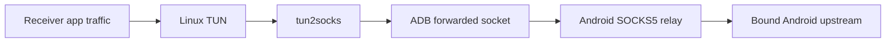
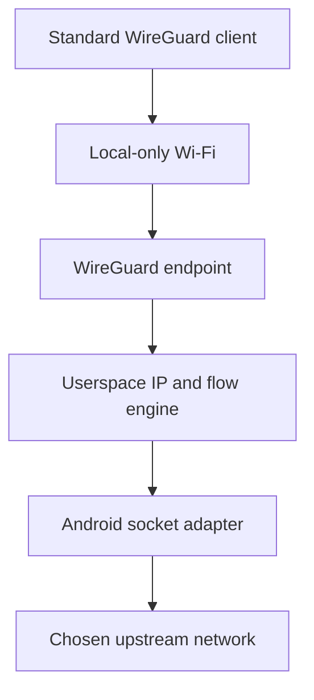

# Architecture

This document describes the intended boundaries and data flow. Anything labeled
**proposed** or **hypothesis** must be validated before it becomes a permanent
dependency.

## Constraints that shape the design

- Android remains stock and unrooted.
- A third-party Android application cannot turn a local-only hotspot into a
  transparent kernel router or expose arbitrary USB Ethernet gadget modes with
  the same control available to a system application.
- Android `VpnService` is designed to capture traffic generated on the Android
  device. It does not automatically capture traffic belonging to other hotspot
  clients.
- Therefore, another device must either use an application proxy, run a thin
  packet-capture connector, or use a standard tunnel protocol that Teather can
  terminate in userspace.
- Receiver route changes are privileged and must be narrowly scoped and
  reversible.
- The design must permit a simple personal deployment before generalizing across
  platforms.

## System contexts

Teather has four stable conceptual layers:

1. **Receiver capture:** obtains traffic from receiver applications.
2. **Local transport:** carries traffic between receiver and phone.
3. **Android relay:** authenticates the receiver and translates flows into Android
   application sockets.
4. **Android upstream:** the network selected for outbound sockets.

UI, discovery, and diagnostics observe or control these layers; they do not merge
them.

## Near-term architecture: SOCKS over ADB



### Android host

Planned responsibilities:

- Request the user-visible foreground-service lifecycle required for a sustained
  relay.
- Discover eligible upstream `Network` instances.
- Bind each outbound socket to the chosen upstream rather than relying blindly on
  the process default.
- Accept only local development traffic in P0.
- Implement SOCKS5 CONNECT for IPv4/domain-name TCP destinations.
- Add authenticated sessions before listening on Wi-Fi or another shared link.
- Track connection counts and byte counters without retaining destination history
  by default.
- Expose structured failure reasons to the UI and development log.

P0 should not require Android `VpnService`. Teather is acting as a relay server,
not capturing the phone's own application traffic.

### ADB transport

P0 uses host-side port forwarding:

```text
Linux 127.0.0.1:<local-port> -> adb -> Android 127.0.0.1:<relay-port>
```

Properties:

- Suitable for personal development.
- Requires USB debugging and an authorized host.
- Does not require stock USB tethering.
- Keeps the relay off the physical network.
- Is not the intended universal transport.

The port numbers are deliberately not fixed in architecture documentation. They
belong in configuration once the implementation exists.

### Linux receiver

P0 begins with application-level proxy configuration. P1 adds:

- a TUN device;
- an existing, pinned `tun2socks` implementation;
- route installation that excludes the ADB/relay path from recursion;
- tunneled DNS;
- signal-safe and crash-recoverable cleanup;
- preflight and postflight state snapshots;
- a diagnostic command that never mutates state.

The initial route manager may be a narrowly scoped script. It must be replaced by
a small daemon or helper before a graphical application is treated as stable.

## Long-term architecture: standard tunnel endpoint

**Hypothesis:** A userspace WireGuard endpoint plus a userspace TCP/IP stack can
turn full receiver IP packets into outbound Android sockets without root.



This path is valuable because WireGuard clients already exist for the target
operating systems. It does not make Android a kernel router; it terminates tunnel
packets in the application and reconstructs their TCP/UDP flows in userspace.

Before accepting this design, a prototype must demonstrate:

- TCP and UDP correctness;
- DNS behavior;
- acceptable throughput and latency;
- bounded memory per flow;
- reliable flow cleanup;
- recovery from Wi-Fi and cellular transitions;
- battery and thermal behavior suitable for the intended sessions;
- compatibility with at least Linux and one mobile receiver.

If the hypothesis fails, Teather retains the private relay protocol plus thin
cross-platform connectors. The transport abstraction remains useful either way.

## Local transports

All transports should expose a common conceptual interface:

```text
start() -> local endpoint
accept/connect(peer)
read/write framed bytes
observe link state
stop()
```

| Transport | Initial role | Authentication boundary | Primary risk |
|---|---|---|---|
| ADB forwarding | P0 development link | ADB host authorization | Requires debugging |
| Local-only hotspot | Default wireless link | Teather pairing keys | Android/vendor variability |
| Wi-Fi Direct | Optional wireless link | Teather pairing keys | Peer/group-owner complexity |
| AOA USB | Later physical link | Teather pairing keys | Device support and framing |
| Bluetooth RFCOMM | Low-bandwidth fallback | Pairing + Teather keys | Throughput and reconnection |
| Existing LAN | Convenience mode | Teather pairing keys | Exposure to untrusted peers |

Transport security must not depend solely on Wi-Fi or Bluetooth link encryption.

## Identity and pairing

Proposed properties:

- The Android installation owns a persistent host identity key.
- Each receiver has its own identity and revocable authorization record.
- First pairing requires an explicit Android-side confirmation.
- QR codes may carry public keys, endpoint details, and short-lived pairing data;
  they must never expose a long-lived Android private key.
- Receiver names are display labels, not security identities.
- A lost receiver can be revoked without resetting every other receiver.

P0 over ADB may use the ADB authorization boundary, but shared-network transports
must not ship without Teather-layer authentication.

## DNS and IPv6

DNS is part of the tunnel, not an afterthought. The design must prevent accidental
fallback to the receiver's previous resolver while Teather is active.

IPv6 behavior is intentionally undecided. Early tests must record:

- whether the Android upstream has IPv6;
- whether the relay engine handles IPv6 destinations;
- whether the receiver emits IPv6 outside the intended path;
- how DNS returns A and AAAA answers;
- the effect of temporarily disabling IPv6 during an IPv4-only milestone.

Permanent IPv6 blocking is not an acceptable substitute for understanding the
path, but temporary explicit disablement may be a documented prototype choice.

## State and recovery

Both sides should expose a state machine similar to:

```text
STOPPED -> STARTING -> LISTENING -> CONNECTING -> CONNECTED
   ^           |           |            |             |
   +-----------+-----------+------------+-------------+
                         STOPPING / FAILED
```

Requirements:

- Transitions are idempotent.
- The UI does not infer state from button presses.
- Network mutations are journaled sufficiently to undo only Teather-owned state.
- Startup detects and repairs residue from an interrupted prior run.
- Failure messages identify Android upstream, local transport, authentication,
  relay protocol, DNS, or receiver routing as separate categories.

## Privilege boundaries

### Android

The baseline uses normal application permissions, user-approved nearby-device
permissions where necessary, foreground-service APIs, and ordinary network
sockets. It does not use root, hidden APIs, or device-owner privileges.

### Linux

TUN creation and route changes require elevated capability. During the prototype,
a reviewed script may run with `sudo`. The durable design should prefer a small
system helper with a fixed API and policy authorization rather than elevating the
UI or networking parser.

## Language direction

- **Kotlin/Compose** is accepted for the Android UI and platform lifecycle.
- **SOCKS5 plus existing tun2socks** is accepted for the initial experiment.
- **Go networking core** is proposed because WireGuard userspace and gVisor-style
  networking components are mature in that ecosystem.
- **Rust receiver/core** remains an alternative where memory safety and native
  platform packaging outweigh reuse of Go networking components.

The permanent core language is deliberately open until P0 clarifies how much of
the system is relay logic versus platform integration.

