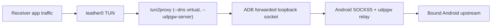
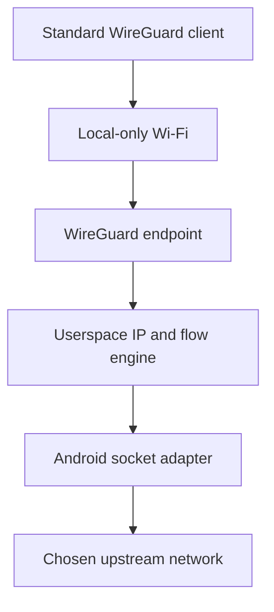

# Architecture

This document describes the intended boundaries and data flow. Anything labeled
**proposed** or **hypothesis** must be validated before it becomes a permanent
dependency.

## Constraints that shape the design

- Android remains stock and unrooted.
- A third-party Android application cannot turn a local-only hotspot into a
  transparent kernel router or expose arbitrary USB Ethernet gadget modes with
  the same control available to a system application.
- Android `VpnService` is designed to capture traffic generated on the Android
  device. It does not automatically capture traffic belonging to other hotspot
  clients.
- Therefore, another device must either use an application proxy, run a thin
  packet-capture connector, or use a standard tunnel protocol that Teather can
  terminate in userspace.
- Receiver route changes are privileged and must be narrowly scoped and
  reversible.
- The design must permit a simple personal deployment before generalizing across
  platforms.

## System contexts

Teather has four stable conceptual layers:

1. **Receiver capture:** obtains traffic from receiver applications.
2. **Local transport:** carries traffic between receiver and phone.
3. **Android relay:** authenticates the receiver and translates flows into Android
   application sockets.
4. **Android upstream:** the network selected for outbound sockets.

UI, discovery, and diagnostics observe or control these layers; they do not merge
them.

## Current architecture: relay over ADB

This is what is implemented and daily-driven (P1 complete + the owner's
post-P1 track; see `docs/PROJECT_STATUS.md`).



TCP and virtual DNS ride the SOCKS5 path; general UDP rides tun2proxy's badvpn
"udpgw" TCP stream, which the phone's `UdpGatewayServer` terminates with a real
`DatagramSocket` bound to the same upstream (D-024) — no VpnService, no packet
stack, no second forward.

### Android host

Implemented responsibilities:

- Request the user-visible foreground-service lifecycle required for a sustained
  relay.
- Discover eligible upstream `Network` instances.
- Bind each outbound socket to the chosen upstream rather than relying blindly on
  the process default.
- Accept only Android-loopback traffic. The listener stays on port 1080 (default)
  and is reached only through an authorized ADB forward.
- Implement SOCKS5 CONNECT for IPv4, domain-name, and literal-IPv6 TCP
  destinations (`Socks5Server`).
- Terminate tun2proxy's udpgw TCP stream for general UDP (`UdpGatewayServer`) —
  one `DatagramSocket` per connection id, bound to the selected upstream;
  reused connection ids are torn down and rebuilt so a stream never leaks a
  stale flow's packets.
- Switch the outbound upstream live on `ACTION_RECONFIGURE` (`NetworkSelector`
  rebind + `RelayRuntime.reconfigure()`) with no listener teardown; sockets
  already open keep their link.
- Add authenticated sessions before listening on Wi-Fi or another shared link
  (still future — the ADB link is loopback-only).
- Track connection counts and byte counters without retaining destination history.
- Expose structured failure reasons to the UI and development log.
- Protect the exported control service with `android.permission.DUMP` (D-016);
  ordinary applications are denied.
- Emit `dumpsys` status schema version 1 (lifecycle, bound/configured port,
  configured and selected upstream, cellular availability/validation, aggregate
  counters, coarse errors) — no destinations or device/subscriber data.

Teather never uses Android `VpnService`: it is a relay server, not a capture of
the phone's own application traffic. This is the structural reason the traffic
looks like the phone's own (the primary goal).

### ADB transport

P0 uses host-side port forwarding:

```text
Linux 127.0.0.1:<local-port> -> adb -> Android 127.0.0.1:<relay-port>
```

Properties:

- Suitable for personal development.
- Requires USB debugging and an authorized host.
- Does not require stock USB tethering.
- Keeps the relay off the physical network.
- Is not the intended universal transport.

The port numbers are deliberately not fixed in architecture documentation. They
belong in configuration once the implementation exists.

### Linux receiver

P0 begins with application-level proxy configuration. The accepted P1 desktop
adds:

- a non-persistent `teather0` TUN device that behaves as a virtual backup network
  interface. Under D-022 NetworkManager creates and owns it as an in-memory
  connection of type `tun`, with `tun.owner` delegation so the unprivileged
  packet engine attaches to it directly;
- pinned `tun2proxy` 0.8.3 with audited packet-framing and TCP virtual-DNS
  patches, run as `--tun teather0`;
- a Teather-owned backup default route (metric 32000, installed only when
  failover is armed) with lower preference than every existing physical default,
  and no mutation of those existing routes;
- a routed `198.18.0.0/15`, virtual mappings limited to `198.18.0.0/16`, and the
  reserved DNS sentinel `198.19.0.1` published at a positive, non-exclusive
  `ipv4.dns-priority`;
- signal-safe and crash-recoverable cleanup (the in-memory connection is deleted on teardown and by next-start `recover()`);
- preflight route/rule/collision refusal checks and a post-activation parity
  snapshot;
- a diagnostic command that never mutates state.

The first P1 mode is not connection bonding and never disables a receiver link.
Wi-Fi and Ethernet remain configured, connected, and preferred while present —
their routes and resolver are untouched. When such a link is actually lost, the
kernel selects the remaining metric-32000 `teather0` default and the resolver
falls through to the sentinel (failover armed). Re-connecting the physical link
makes it preferred again without a Teather restart. `teather failover off` keeps
`teather0` present but with no default route and no DNS entry until armed.

Under D-022 the per-user `teatherd` asks NetworkManager to create and own the
`teather0` connection; it creates no persistent profile and never changes an
existing link. Teather must never delete or replace an existing default route,
edit `/etc/resolv.conf` directly, flush firewall state, or persist the
connection. Deactivating the in-memory connection (on disconnect, tunnel death,
or next-start recovery) removes `teather0`, its routes, and its DNS entry.

P1 is split across two privilege levels — there is no privileged component:

1. The unprivileged per-user `teatherd` daemon owns ADB discovery, trust,
   selection, state, D-Bus, journaling, process supervision, the preflight
   refusal checks, and the NetworkManager connection lifecycle.
2. Unprivileged GTK/tray and CLI clients use the same manager API and never
   manipulate networking directly.

`teatherd` builds a fixed connection dictionary — type `tun`, `teather0`,
`192.0.2.1/32`, MTU 1500, `198.18.0.0/15`, a metric-32000 backup default (armed
only when failover is on), the `198.19.0.1` sentinel at a positive non-exclusive
priority, `tun.owner`/`tun.group` = the running user — and activates it through
`AddConnection2` (in-memory flag) then `ActivateConnection`. Before doing so it refuses
collisions (including routes overlapping the virtual-DNS pool), an existing
`teather0`, an invalid loopback proxy port, any nonstandard IPv4 policy rule,
ambiguous VPN/split-default policy, and a default route that cannot remain
preferred. `tun2proxy` then attaches to the resulting `tun.owner`-delegated
device as the desktop user.

The tunnel settings are IPv4-only, virtual DNS enabled, 64 sessions, 300-second
TCP timeout, MTU 1500, and destination logging disabled.
Built-in setup, daemonization, UDP gateway, and evasion features are disabled.
The in-memory NetworkManager connection owns interface lifetime; `teatherd` death
plus next-start `recover()` removes it, and NetworkManager itself deletes it on
deactivation.

#### Historical P1 resolver gate — superseded by D-021

P0 application clients use SOCKS hostname resolution (`socks5h`), so their DNS
queries are resolved on the selected Android network. A transparent TUN changes
that ordering: ordinary Linux applications commonly call the host resolver before
opening a TCP connection. When the owner disables Wi-Fi, NetworkManager may remove
that link's resolver or leave a private LAN resolver that cannot be reached over
Teather. The TUN route could therefore be healthy while hostname-based Internet
access still fails.

The original P1 design selected tun2proxy virtual DNS: DNS packets addressed to an existing usable
non-loopback IPv4 nameserver enter `teather0`; tun2proxy maps responses into
`198.18.0.0/15` and later opens SOCKS domain requests so Android performs upstream
resolution. P1 does not carry arbitrary UDP.

The original daemon inspected resolver state immediately after the owner disabled Wi-Fi.
If no usable non-loopback IPv4 nameserver remains, it closes the tunnel safely and
reports that P1 DNS is unsupported on that host. It does not call `resolvectl`,
write `/etc/resolv.conf`, or alter NetworkManager. A retained but unreachable
nameserver is a physical acceptance failure and returns the design to review.

**Physical result and supersession (2026-08-27):** disabling Wi-Fi on the target Linux host removed
its only usable non-loopback IPv4 nameserver. The daemon reported
`resolver-unavailable`, closed the tunnel, and restored owned state. That design
could not satisfy P1 on the host and is retained here only as failure history.
D-021's replacement below was implemented and ran its VM validation; see the
disproof note after it. The host uses NetworkManager's default DNS mode to
write a regular `/etc/resolv.conf`; neither `systemd-resolved` nor `resolvconf`
is installed.

**Replacement implemented, then disproven (D-021):** NetworkManager was to
temporarily advertise the dedicated `198.19.0.1` sentinel only on the
externally observed `teather0` connection with DNS priority `-32768`.
`Reapply` uses the preserve-external-IP flag, and the daemon verifies the TUN
address/routes are unchanged. Virtual DNS answers UDP and length-prefixed TCP
port 53; mappings use `198.18.0.0/16`, so the sentinel cannot collide.
Connection fails closed unless resolver state and both DNS probes pass. Normal
teardown restores the original applied connection and next-start recovery
performs a bounded NetworkManager DNS regeneration only for unambiguous stale
sentinel state.

**Disproven, then replaced (D-022, 2026-08-29, package `0.1.0-4`):** the
disposable-VM matrix confirmed the SSH/remote PolicyKit gate is resolved, but
`Reapply` never propagated the sentinel/priority/`ignore-auto-dns` settings to
`/etc/resolv.conf`, because `teather0` was an *externally-assumed* NetworkManager
connection (Teather's old helper created it with raw `ip` commands) and
`Reapply` does not regenerate the live `IP4Config` for that connection type.
Reproduced identically under TCG and KVM.

**Current mechanism (D-022):** NetworkManager creates and owns `teather0` from
the start as an in-memory connection of type `tun`:

- `tun.owner`/`tun.group` = the desktop user, so `tun2proxy` opens the device
  directly with no privileged helper;
- `ipv4.method=manual` with the fixed `192.0.2.1/32` address and the
  `198.18.0.0/15` + metric-32000 backup-default routes (the default route only
  when failover is armed);
- `ipv4.dns-data=[198.19.0.1]` at a **positive** `ipv4.dns-priority` (`32050`)
  with `ignore-auto-dns=false` — additive and non-exclusive, so
  `/etc/resolv.conf` lists the physical link's resolver first while it is
  present and the sentinel only afterwards. This is the property that keeps
  working Wi-Fi working; `_verify_additive()` fails the connection closed if
  arming ever leaves the sentinel as the only resolver;
- never written to disk, deleted on teardown and by next-start `recover()`, and removed by the next `teatherd` start's `recover()` if a
  `SIGKILL` skipped teardown.

This also changed the operating model: automatic failover once the physical
link's route and resolver disappear is now the default (config
`auto_failover`, on by default), with `teather failover off` leaving Teather
connected but dormant — no default route, no DNS — until armed, because the
phone's upstream may be metered. Wi-Fi and Ethernet are never touched in either
mode. See D-022 in `docs/DECISIONS.md` and E-002 in `docs/EXPERIMENTS.md`.

P1 implements the route boundary through the unprivileged per-user daemon and
NetworkManager. The graphical application does not manipulate networking
directly.

The user daemon runs with `NoNewPrivileges=yes`, `ProtectSystem=strict`,
`ProtectHome=read-only`, `RestrictSUIDSGID=yes`, and `PrivateTmp=yes` (D-022;
D-020's `NoNewPrivileges=no` requirement is gone with the setuid-root helper).
There is no privileged implementation surface: `teatherd` and `tun2proxy` both
run as the desktop user, and NetworkManager performs the interface work over
its D-Bus API.

## Next evolution, not the end state: standard tunnel endpoint

This is Teather's next major step past P1-P3, not its final architecture.
WireGuard is now the de facto standard tunnel primitive — mainline Linux kernel
since 2020, mature first-party clients on every target platform, and the base
that later mesh-VPN products (Tailscale and similar) were built on. Standard
WireGuard-client compatibility is worth pursuing because it *opens up* further
evolution (richer pairing, multi-device support, possibly mesh-style features
later) by removing the need for a custom receiver per platform, not because
reaching it ends the project's evolution. What comes after is intentionally
undesigned until this step is proven; P5-P7 in `docs/ROADMAP.md` already
assume further work follows it.

**Hypothesis:** A userspace WireGuard endpoint plus a userspace TCP/IP stack can
turn full receiver IP packets into outbound Android sockets without root.



This path is valuable because WireGuard clients already exist for the target
operating systems. It does not make Android a kernel router; it terminates tunnel
packets in the application and reconstructs their TCP/UDP flows in userspace.

Before accepting this design, a prototype must demonstrate:

- TCP and UDP correctness;
- DNS behavior;
- acceptable throughput and latency;
- bounded memory per flow;
- reliable flow cleanup;
- recovery from Wi-Fi and cellular transitions;
- battery and thermal behavior suitable for the intended sessions;
- compatibility with at least Linux and one mobile receiver.

If the hypothesis fails, Teather retains the private relay protocol plus thin
cross-platform connectors. The transport abstraction remains useful either way.

## Local transports

All transports should expose a common conceptual interface:

```text
start() -> local endpoint
accept/connect(peer)
read/write framed bytes
observe link state
stop()
```

| Transport | Initial role | Authentication boundary | Primary risk |
|---|---|---|---|
| ADB forwarding | P0 development link | ADB host authorization | Requires debugging |
| Local-only hotspot | Default wireless link | Teather pairing keys | Android/vendor variability |
| Wi-Fi Direct | Optional wireless link | Teather pairing keys | Peer/group-owner complexity |
| AOA USB | Later physical link | Teather pairing keys | Device support and framing |
| Bluetooth RFCOMM | Low-bandwidth fallback | Pairing + Teather keys | Throughput and reconnection |
| Existing LAN | Convenience mode | Teather pairing keys | Exposure to untrusted peers |

Transport security must not depend solely on Wi-Fi or Bluetooth link encryption.

## Identity and pairing

Proposed properties:

- The Android installation owns a persistent host identity key.
- Each receiver has its own identity and revocable authorization record.
- First pairing requires an explicit Android-side confirmation.
- QR codes may carry public keys, endpoint details, and short-lived pairing data;
  they must never expose a long-lived Android private key.
- Receiver names are display labels, not security identities.
- A lost receiver can be revoked without resetting every other receiver.

P0 over ADB may use the ADB authorization boundary, but shared-network transports
must not ship without Teather-layer authentication.

## DNS and IPv6

DNS is part of the tunnel, not an afterthought. Under D-022 it is *additive*
rather than exclusive: the physical resolver stays first in `/etc/resolv.conf`
while a physical link is present, and the Teather sentinel `198.19.0.1` (routed,
never allocated) is used only once that link is gone. `dns_probe` verifies UDP
and TCP virtual DNS before the daemon reports connected.

IPv6 through Teather is currently **unsupported** — `ipv6.method = disabled` on
the `teather0` connection, and the relay only handles IPv4 egress. A future IPv6
milestone still needs to record:

- whether the Android upstream has IPv6;
- whether the relay engine handles IPv6 destinations;
- whether the receiver emits IPv6 outside the intended path;
- how DNS returns A and AAAA answers;
- the effect of temporarily disabling IPv6 during an IPv4-only milestone.

Permanent IPv6 blocking is not an acceptable substitute for understanding the
path, but temporary explicit disablement may be a documented prototype choice.

## State and recovery

Both sides should expose a state machine similar to:

```text
STOPPED -> STARTING -> LISTENING -> CONNECTING -> CONNECTED
   ^           |           |            |             |
   +-----------+-----------+------------+-------------+
                         STOPPING / FAILED
```

Requirements:

- Transitions are idempotent.
- The UI does not infer state from button presses.
- Network mutations are journaled sufficiently to undo only Teather-owned state.
- Startup detects and repairs residue from an interrupted prior run.
- Failure messages identify Android upstream, local transport, authentication,
  relay protocol, DNS, or receiver routing as separate categories.

As of D-026 (`0.1.0-11`) the Linux daemon goes further than "repair on startup":
its poll loop runs `reconcile()` + an expanded `health_check()` continuously, so
an abnormal loss (phone unplug, ADB forward drop, tun2proxy exit, `teather0`
removed, relay stopped) is detected within seconds, the host side is released to
a clean `disconnected` state (new `last_drop` field, not `error`), and
auto-connect reconnects once the phone is reachable — no manual `teather
recover`. The host side stays strict: an unverifiable `teather0` still stops with
`ambiguous-interface`. A user `disconnect` is the only path that stops the phone
relay; every self-heal path and the daemon shutdown leave it running for the
next start to adopt.

## Privilege boundaries

### Android

The baseline uses normal application permissions, user-approved nearby-device
permissions where necessary, foreground-service APIs, and ordinary network
sockets. It does not use root, hidden APIs, or device-owner privileges.

### Linux

TUN creation and route changes are performed by NetworkManager on `teatherd`'s
request over its D-Bus API, using the `settings.modify.own` and
`network-control` actions an active local session already holds (D-022). There
is no setuid-root helper, no custom polkit action, and no sudo policy. The GUI,
CLI, daemon, ADB parser, and packet engine all run as the desktop user.

### Linux control and persistence

The session manager is `io.github.vel71184.Teather1` on the user bus. Stable
methods return `a{sv}` or arrays of `a{sv}` so fields can be added compatibly.
The daemon stores only a random local salt, salted device hashes, display names,
and preferences in a mode-0600 file. A separate mode-0600 runtime journal records
the exact ADB forward and whether Linux started Android; restart recovery removes
only matching owned resources. Raw serials exist only in process memory and ADB
arguments and never enter logs, D-Bus responses, or disk.

## Language direction

- **Kotlin/Compose** is accepted for the Android UI and platform lifecycle.
- **SOCKS5 plus existing tun2proxy** is accepted for the initial experiment.
- **Go networking core** is proposed because WireGuard userspace and gVisor-style
  networking components are mature in that ecosystem.
- **Rust receiver/core** remains an alternative where memory safety and native
  platform packaging outweigh reuse of Go networking components.


## Implemented component map

### Android (`app/`)

| Component | Implementation | Boundary |
|---|---|---|
| Control/UI | `MainActivity` | Port + upstream picker, start/stop, live status, clipboard helper |
| Lifecycle | `RelayService`, `RelayRuntime` | `DUMP`-protected foreground service; `START`/`STOP`/`RECONFIGURE`; idempotent teardown |
| Upstream | `NetworkSelector`, `UpstreamPreference`, `AndroidNetworkConnector` | Picks a non-VPN Android `Network`; live-swappable; binds DNS + each outbound socket |
| TCP protocol | `Socks5Protocol`, `Socks5Server` | SOCKS5 negotiation + `CONNECT` (v4/domain/v6); loopback accept, limits, timeouts, copying |
| UDP protocol | `UdpGatewayProtocol`, `UdpGatewayServer` | badvpn udpgw framing; one `DatagramSocket` per connection id |
| Metrics/status | `RelayStats`, `RelayStatusWire` | Aggregate counts, byte totals, error categories; `dumpsys` schema 1 |

### Linux (`desktop/linux/teather/`)

| Component | Implementation | Boundary |
|---|---|---|
| Daemon | `daemon.py` → `teatherd` | `systemd --user` D-Bus service; poll loop reconcile → health_check → auto-connect |
| Orchestration | `Manager` | connect/disconnect/recover/reconcile/health; owns tun2proxy child, ADB forward, ownership journal |
| Interface owner | `NetworkManagerConnection` | The one in-memory `tun` `teather0` connection; additive DNS; `CheckConnectivity` nudge |
| Preflight | `preflight.py` | Refuses unsafe route/rule/interface states; recognises standalone |
| DNS readiness | `dns_probe.py` | UDP + TCP virtual-DNS check before "connected" |
| ADB | `AdbClient` | devices / forward / dumpsys / relay control; serials redacted |
| Logging | `logging_setup.py` | Rotating `~/.local/state/teather/teatherd.log` (0600) |
| D-Bus + notify | `dbus_service.py` | `io.github.vel71184.Teather1.Manager`; self-clearing toasts |
| CLI | `cli.py` → `teather` | Pure D-Bus client for every method |
| GUI | `gui.py` → `teather-gtk` | Single-instance GTK3 window + optional tray |
| Config | `config.py` | Mode-0600 JSON; salted device-id hashes, never raw serials |
| Historical | `desktop/linux/teather-p0` | P0 ADB-forward + smoke/soak helper (superseded) |

D-016: the Android control service is exported in both debug and release behind
`android.permission.DUMP` — authorized ADB shell control, ordinary applications
denied. The data plane stays bound to `127.0.0.1`.

The permanent cross-platform networking-core language remains open under D-008.
P1's pinned Rust packet engine does not settle that later architectural choice.
