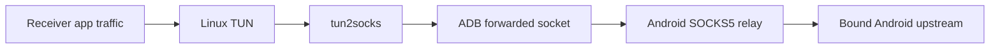
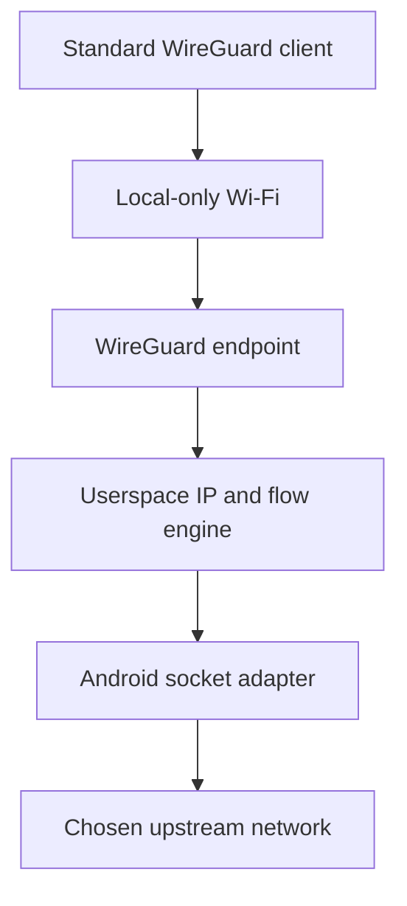

# Architecture

This document describes the intended boundaries and data flow. Anything labeled
**proposed** or **hypothesis** must be validated before it becomes a permanent
dependency.

## Constraints that shape the design

- Android remains stock and unrooted.
- A third-party Android application cannot turn a local-only hotspot into a
  transparent kernel router or expose arbitrary USB Ethernet gadget modes with
  the same control available to a system application.
- Android `VpnService` is designed to capture traffic generated on the Android
  device. It does not automatically capture traffic belonging to other hotspot
  clients.
- Therefore, another device must either use an application proxy, run a thin
  packet-capture connector, or use a standard tunnel protocol that Teather can
  terminate in userspace.
- Receiver route changes are privileged and must be narrowly scoped and
  reversible.
- The design must permit a simple personal deployment before generalizing across
  platforms.

## System contexts

Teather has four stable conceptual layers:

1. **Receiver capture:** obtains traffic from receiver applications.
2. **Local transport:** carries traffic between receiver and phone.
3. **Android relay:** authenticates the receiver and translates flows into Android
   application sockets.
4. **Android upstream:** the network selected for outbound sockets.

UI, discovery, and diagnostics observe or control these layers; they do not merge
them.

## Near-term architecture: SOCKS over ADB



### Android host

Implemented P0 responsibilities and accepted P1 extensions:

- Request the user-visible foreground-service lifecycle required for a sustained
  relay.
- Discover eligible upstream `Network` instances.
- Bind each outbound socket to the chosen upstream rather than relying blindly on
  the process default.
- Accept only Android-loopback traffic. P1 keeps the listener on port 1080 and
  reaches it only through an authorized ADB forward.
- Implement SOCKS5 CONNECT for IPv4/domain-name TCP destinations.
- Add authenticated sessions before listening on Wi-Fi or another shared link.
- Track connection counts and byte counters without retaining destination history
  by default.
- Expose structured failure reasons to the UI and development log.
- Protect the exported release control service with `android.permission.DUMP`.
  Application-namespaced start/stop actions are available to authorized ADB
  shell, while ordinary applications are denied.
- Emit `dumpsys` status schema version 1 with lifecycle, bound port, configured
  and selected upstream, cellular availability/validation, aggregate counters,
  and coarse errors. Status contains no destinations or device/subscriber data.

P0 should not require Android `VpnService`. Teather is acting as a relay server,
not capturing the phone's own application traffic.

### ADB transport

P0 uses host-side port forwarding:

```text
Linux 127.0.0.1:<local-port> -> adb -> Android 127.0.0.1:<relay-port>
```

Properties:

- Suitable for personal development.
- Requires USB debugging and an authorized host.
- Does not require stock USB tethering.
- Keeps the relay off the physical network.
- Is not the intended universal transport.

The port numbers are deliberately not fixed in architecture documentation. They
belong in configuration once the implementation exists.

### Linux receiver

P0 begins with application-level proxy configuration. The accepted P1 desktop
adds:

- a non-persistent `teather0` TUN device that behaves as a virtual backup network
  interface;
- pinned `tun2proxy` 0.8.3 with audited inherited-fd, packet-framing, and TCP
  virtual-DNS patches;
- a Teather-owned default route with lower preference than every existing
  physical default and no mutation of those existing routes;
- route installation that excludes the loopback ADB/relay path from recursion;
- a routed `198.18.0.0/15`, virtual mappings limited to `198.18.0.0/16`, and the
  reserved temporary NetworkManager DNS sentinel `198.19.0.1`;
- signal-safe and crash-recoverable cleanup;
- preflight and postflight state snapshots;
- a diagnostic command that never mutates state.

The first P1 mode is not connection bonding and does not automatically disable a
receiver link. Wi-Fi and Ethernet remain configured, connected, and preferred
while present. After Teather reports ready, the owner may manually disable Wi-Fi;
the kernel can then select the remaining `teather0` default. Re-enabling Wi-Fi
must make the pre-existing physical default preferred again without a Teather
restart.

Under D-021 the P1 receiver performs one bounded NetworkManager active-device
DNS update on `teather0`; it creates no persistent profile and never changes an
existing link. It must never delete or replace an existing default route, edit
`/etc/resolv.conf` directly, flush firewall state, or persist the TUN. Closing or crashing
the owner process must remove `teather0` and its attached routes automatically;
explicit cleanup handles any additional Teather-owned state.

P1 is split across three privilege levels:

1. The unprivileged per-user `teatherd` daemon owns ADB discovery, trust,
   selection, state, D-Bus, journaling, and process supervision.
2. Unprivileged GTK/tray and CLI clients use the same manager API and never
   manipulate networking directly.
3. A root-owned helper invoked by `pkexec` validates a fixed request, opens TUN,
   creates the allowed interface state, drops capabilities/groups/GID/UID, sets
   parent-death handling, and execs the pinned tunnel with the inherited file
   descriptor.

The helper creates exactly `teather0`, `192.0.2.1/32`, MTU 1500,
`198.18.0.0/15 dev teather0`, and `default dev teather0 metric 32000`. It refuses
collisions (including routes overlapping the virtual-DNS pool), unexpected
arguments, invalid `PKEXEC_UID`, an invalid loopback proxy port, any nonstandard
IPv4 policy rule, ambiguous VPN/split-default policy, and route preference that
cannot remain secondary. It clears its environment and permanently drops
privilege before the packet engine parses traffic.

The tunnel settings are IPv4-only, virtual DNS enabled, 64 sessions, 300-second
TCP timeout, MTU 1500, and destination logging disabled. Built-in setup,
daemonization, UDP gateway, and evasion features are disabled. The non-persistent
TUN descriptor owns interface lifetime; daemon/helper death closes it and removes
interface-bound routes.

#### Historical P1 resolver gate — superseded by D-021

P0 application clients use SOCKS hostname resolution (`socks5h`), so their DNS
queries are resolved on the selected Android network. A transparent TUN changes
that ordering: ordinary Linux applications commonly call the host resolver before
opening a TCP connection. When the owner disables Wi-Fi, NetworkManager may remove
that link's resolver or leave a private LAN resolver that cannot be reached over
Teather. The TUN route could therefore be healthy while hostname-based Internet
access still fails.

The original P1 design selected tun2proxy virtual DNS: DNS packets addressed to an existing usable
non-loopback IPv4 nameserver enter `teather0`; tun2proxy maps responses into
`198.18.0.0/15` and later opens SOCKS domain requests so Android performs upstream
resolution. P1 does not carry arbitrary UDP.

The original daemon inspected resolver state immediately after the owner disabled Wi-Fi.
If no usable non-loopback IPv4 nameserver remains, it closes the tunnel safely and
reports that P1 DNS is unsupported on that host. It does not call `resolvectl`,
write `/etc/resolv.conf`, or alter NetworkManager. A retained but unreachable
nameserver is a physical acceptance failure and returns the design to review.

**Physical result and supersession (2026-08-27):** disabling Wi-Fi on the target Linux host removed
its only usable non-loopback IPv4 nameserver. The daemon reported
`resolver-unavailable`, closed the tunnel, and restored owned state. That design
could not satisfy P1 on the host and is retained here only as failure history.
D-021's accepted replacement below is implemented and awaiting VM validation.
The host uses NetworkManager's default DNS mode to write a regular
`/etc/resolv.conf`; neither `systemd-resolved` nor `resolvconf` is installed.

**Accepted replacement (D-021):** NetworkManager temporarily advertises the
dedicated `198.19.0.1` sentinel only on the externally observed `teather0`
connection with DNS priority `-32768`. `Reapply` uses the preserve-external-IP
flag, and the daemon verifies the TUN address/routes are unchanged. Virtual DNS
answers UDP and length-prefixed TCP port 53; mappings use `198.18.0.0/16`, so the
sentinel cannot collide. Connection fails closed unless resolver state and both
DNS probes pass. Normal teardown restores the original applied connection and
next-start recovery performs a bounded NetworkManager DNS regeneration only for
unambiguous stale sentinel state.

P1 implements the route boundary through the fixed helper and per-user daemon
described above. The graphical application does not manipulate networking
directly.

The user daemon retains `ProtectSystem=strict`, `ProtectHome=read-only`, and
`PrivateTmp=yes`, but D-020 requires `NoNewPrivileges=no`: setuid-root `pkexec`
cannot reach the fixed PolicyKit helper when its parent has `NoNewPrivs: 1`. The
root-owned helper remains the only privileged implementation surface and applies
`NoNewPrivs: 1` after permanently dropping privilege for the packet engine.

## Long-term architecture: standard tunnel endpoint

**Hypothesis:** A userspace WireGuard endpoint plus a userspace TCP/IP stack can
turn full receiver IP packets into outbound Android sockets without root.



This path is valuable because WireGuard clients already exist for the target
operating systems. It does not make Android a kernel router; it terminates tunnel
packets in the application and reconstructs their TCP/UDP flows in userspace.

Before accepting this design, a prototype must demonstrate:

- TCP and UDP correctness;
- DNS behavior;
- acceptable throughput and latency;
- bounded memory per flow;
- reliable flow cleanup;
- recovery from Wi-Fi and cellular transitions;
- battery and thermal behavior suitable for the intended sessions;
- compatibility with at least Linux and one mobile receiver.

If the hypothesis fails, Teather retains the private relay protocol plus thin
cross-platform connectors. The transport abstraction remains useful either way.

## Local transports

All transports should expose a common conceptual interface:

```text
start() -> local endpoint
accept/connect(peer)
read/write framed bytes
observe link state
stop()
```

| Transport | Initial role | Authentication boundary | Primary risk |
|---|---|---|---|
| ADB forwarding | P0 development link | ADB host authorization | Requires debugging |
| Local-only hotspot | Default wireless link | Teather pairing keys | Android/vendor variability |
| Wi-Fi Direct | Optional wireless link | Teather pairing keys | Peer/group-owner complexity |
| AOA USB | Later physical link | Teather pairing keys | Device support and framing |
| Bluetooth RFCOMM | Low-bandwidth fallback | Pairing + Teather keys | Throughput and reconnection |
| Existing LAN | Convenience mode | Teather pairing keys | Exposure to untrusted peers |

Transport security must not depend solely on Wi-Fi or Bluetooth link encryption.

## Identity and pairing

Proposed properties:

- The Android installation owns a persistent host identity key.
- Each receiver has its own identity and revocable authorization record.
- First pairing requires an explicit Android-side confirmation.
- QR codes may carry public keys, endpoint details, and short-lived pairing data;
  they must never expose a long-lived Android private key.
- Receiver names are display labels, not security identities.
- A lost receiver can be revoked without resetting every other receiver.

P0 over ADB may use the ADB authorization boundary, but shared-network transports
must not ship without Teather-layer authentication.

## DNS and IPv6

DNS is part of the tunnel, not an afterthought. The design must prevent accidental
fallback to the receiver's previous resolver while Teather is active.

IPv6 behavior is intentionally undecided. Early tests must record:

- whether the Android upstream has IPv6;
- whether the relay engine handles IPv6 destinations;
- whether the receiver emits IPv6 outside the intended path;
- how DNS returns A and AAAA answers;
- the effect of temporarily disabling IPv6 during an IPv4-only milestone.

Permanent IPv6 blocking is not an acceptable substitute for understanding the
path, but temporary explicit disablement may be a documented prototype choice.

## State and recovery

Both sides should expose a state machine similar to:

```text
STOPPED -> STARTING -> LISTENING -> CONNECTING -> CONNECTED
   ^           |           |            |             |
   +-----------+-----------+------------+-------------+
                         STOPPING / FAILED
```

Requirements:

- Transitions are idempotent.
- The UI does not infer state from button presses.
- Network mutations are journaled sufficiently to undo only Teather-owned state.
- Startup detects and repairs residue from an interrupted prior run.
- Failure messages identify Android upstream, local transport, authentication,
  relay protocol, DNS, or receiver routing as separate categories.

## Privilege boundaries

### Android

The baseline uses normal application permissions, user-approved nearby-device
permissions where necessary, foreground-service APIs, and ordinary network
sockets. It does not use root, hidden APIs, or device-owner privileges.

### Linux

TUN creation and route changes are confined to the installed root-owned helper
and a narrowly scoped polkit action. The GUI, CLI, daemon, ADB parser, and packet
engine run as the desktop user. No wildcard or passwordless sudo policy is used.

### Linux control and persistence

The session manager is `io.github.vel71184.Teather1` on the user bus. Stable
methods return `a{sv}` or arrays of `a{sv}` so fields can be added compatibly.
The daemon stores only a random local salt, salted device hashes, display names,
and preferences in a mode-0600 file. A separate mode-0600 runtime journal records
the exact ADB forward and whether Linux started Android; restart recovery removes
only matching owned resources. Raw serials exist only in process memory and ADB
arguments and never enter logs, D-Bus responses, or disk.

## Language direction

- **Kotlin/Compose** is accepted for the Android UI and platform lifecycle.
- **SOCKS5 plus existing tun2socks** is accepted for the initial experiment.
- **Go networking core** is proposed because WireGuard userspace and gVisor-style
  networking components are mature in that ecosystem.
- **Rust receiver/core** remains an alternative where memory safety and native
  platform packaging outweigh reuse of Go networking components.


## Implemented P0 component map

The first concrete implementation preserves the planned boundaries:

| Component | Current implementation | Boundary |
|---|---|---|
| Control/UI | `MainActivity` | Starts/stops relay and renders aggregate state |
| Lifecycle | `RelayService` and `RelayRuntime` | Foreground-service ownership and idempotent teardown |
| Upstream | `AndroidNetworkConnector` | Selects a non-VPN Android `Network`; binds DNS and sockets |
| Protocol | `Socks5Protocol` | Parses negotiation and TCP `CONNECT` without Android imports |
| Relay | `Socks5Server` | Loopback accept, limits, timeouts, bidirectional copying |
| Metrics | `RelayStats` | Aggregate counts and coarse errors only |
| Transport helper | `desktop/linux/teather-p0` | ADB forward, lifecycle, smoke/soak, cleanup |

P0 originally exported the lifecycle service only in debug builds. D-016
supersedes that arrangement: debug and release now export the service behind
`android.permission.DUMP`, allowing authorized ADB shell control while denying
ordinary applications. The data plane remains bound to `127.0.0.1`. P0 itself
did not touch Linux routes, resolver settings, or firewall state.

The permanent cross-platform networking-core language remains open under D-008.
P1's pinned Rust packet engine does not settle that later architectural choice.
