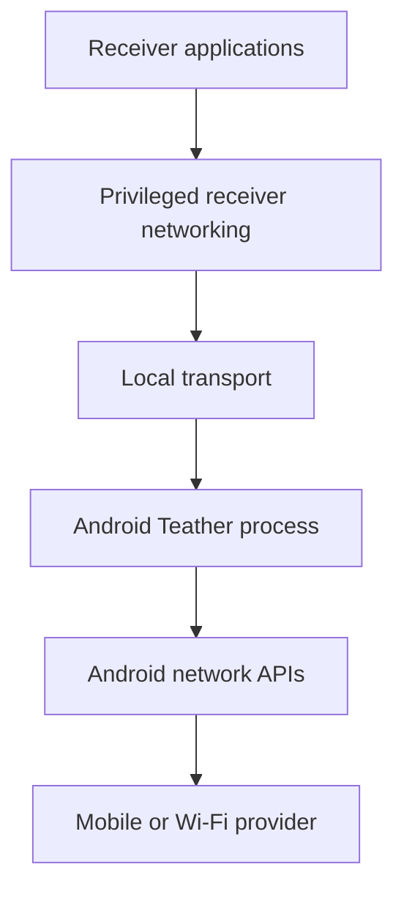

# Threat model

Teather carries arbitrary receiver traffic and changes receiver networking state.
Even as a personal project, it must be designed as security-sensitive software.

## Assets

- Confidentiality and integrity of relayed traffic.
- Android host identity and authorized-receiver records.
- Receiver identity and tunnel keys.
- Availability of the phone's upstream connection.
- Integrity of Linux routes, DNS, and firewall state.
- User privacy, including destinations and usage patterns.
- Android device integrity required by Google Wallet/Pay and other applications.

## Trust boundaries

- Receiver applications may be buggy or hostile.
- The local USB/Wi-Fi/Bluetooth link is not inherently trusted.
- Android and receiver operating systems are trusted within their documented
  security models.
- The upstream provider and Internet are untrusted transports.
- Teather does not decrypt application TLS and must not attempt to do so.

## Primary threats and mitigations

### Unauthorized relay use

**Threat:** A nearby or LAN peer discovers Teather and consumes the phone's data.

**Mitigations:**

- Bind P0 only to Android loopback and reach it through ADB forwarding.
- Treat P0 no-auth SOCKS as a controlled debug experiment, not a releasable
  authentication design. Android loopback is also reachable by other local apps.
- Protect the exported release lifecycle service with the signature-level
  `android.permission.DUMP` permission. Authorized ADB shell can control it;
  ordinary applications cannot.
- Limit P0 to 64 sessions with handshake, connect, and idle timeouts.
- Require explicit pairing before any shared-link or post-P0 daily-driver use.
- Give every receiver a distinct revocable identity.
- Apply connection, flow, and byte-rate limits where practical.
- Show active receiver count and identity on Android once identities exist.

### Traffic observation or modification on the local link

**Threat:** A local peer observes or alters relay traffic despite Wi-Fi/Bluetooth
link security.

**Mitigations:**

- Use authenticated encryption at the Teather session layer.
- Prefer established cryptographic protocols and libraries.
- Never design custom cryptographic primitives.
- Bind identity to the pairing confirmation.

ADB P0 relies on ADB host authorization and physical control but should not be
mistaken for the final shared-link security model. Its no-auth loopback listener
does not exclude other applications already running on the phone. Use only a
development phone state the owner trusts, stop it after testing, and add receiver
authentication before promoting the path beyond P0.

### Malicious protocol input

**Threat:** A receiver sends malformed frames, oversized requests, excessive
flows, or pathological fragmentation to crash or exhaust the phone.

**Mitigations:**

- Strict parsing and bounded allocations.
- Per-receiver flow and memory limits.
- Timeouts and backpressure.
- Fuzz protocol parsers once stable.
- Avoid exposing unsafe native parsers without containment and tests.

### Receiver route or DNS damage

**Threat:** Teather exits after changing networking state, leaving the receiver
offline or leaking traffic through an unintended path.

**Mitigations:**

- Snapshot relevant state before mutation.
- Tag and journal only Teather-owned changes.
- Idempotent cleanup on exit and next start.
- Network-namespace/VM tests before host-level mutation.
- Emergency diagnostic and restoration command.
- Never delete unrelated routes or firewall rules.
- Keep existing NetworkManager-managed Wi-Fi/Ethernet connections, profiles,
  routes, and DNS untouched. D-022 permits exactly one in-memory, non-persistent
  NetworkManager `tun` connection for `teather0` and nothing else.
- That connection is created in memory only (never written to
  `/etc/NetworkManager/system-connections`) and is deleted when it deactivates,
  so process death and `SIGKILL` recovery both remove it. Its default route
  (present only when failover is armed) has a worse metric than every physical
  default, so restoring Wi-Fi independently restores Internet access.
- Do not write `/etc/resolv.conf` directly or create persistent resolver state.
  Reserve a sentinel outside the virtual mapping pool, use a *positive*
  (non-exclusive) `ipv4.dns-priority` so the physical resolver stays ahead of
  it while present, verify UDP/TCP readiness, fail closed if the sentinel ever
  becomes the only resolver while a physical link is up, and treat any residue
  or physical-link change as cleanup failure.

### Privilege escalation on Linux

**Threat:** A parser, GUI, or receiver-controlled value reaches a privileged
network-management operation.

**Mitigations (D-022):**

- Keep UI and protocol parsing unprivileged.
- Ship **no setuid-root helper and no custom polkit action.** D-021's helper was
  a 350-line setuid-root C program; Phase 2 found three argument-parsing defects
  in it. D-022 deletes it, its route/rule parser, and its man page.
- `teatherd` and `tun2proxy` run entirely as the desktop user. `teatherd` asks
  NetworkManager — already root, already running, already managing every other
  interface — to create the `teather0` connection over D-Bus. This uses
  `settings.modify.own` and `network-control`, which an active local session
  already holds, so `teatherd` gains nothing the user could not already do with
  `nmcli`, and the normal path needs no authentication prompt.
- The connection is a fixed, code-built dictionary: type `tun`, name `teather0`,
  `192.0.2.1/32`, the two fixed routes, the sentinel, `tun.owner` = the running
  uid. The only receiver-influenced value is the numeric loopback proxy port,
  which is range-checked.
- `tun2proxy` opens the `tun.owner`-delegated device by name with `--setup
  false`; it never configures addresses or routes and needs no capability.
- `teatherd` runs with `NoNewPrivileges=yes`, `ProtectSystem=strict`,
  `ProtectHome=read-only`, `RestrictSUIDSGID=yes`, and `PrivateTmp=yes`.
- Refuse conflicting host network state (existing `teather0`, address/route
  collisions, nonstandard IPv4 policy rules, VPN/split-default ambiguity, an
  existing default that cannot stay preferred) before creating the connection —
  enforced in `desktop/linux/teather/preflight.py`, never by deleting anything.
- The connection is in-memory only: the next `teatherd` start's `recover()` removes a stale one left by `SIGKILL`,
  refusing to touch a `teather0` it does not own.

### Device identity disclosure

**Threat:** ADB serials in configuration, logs, D-Bus, or support output identify
the owner's phone.

**Mitigations:**

- Keep raw serials only in short-lived process memory and direct ADB arguments.
- Persist and display a locally salted identifier hash, never the serial.
- Store trust and runtime journals with mode 0600 and reject unsafe ownership or
  permissions.
- Redact subprocess output before it reaches logs or diagnostics.

### Ambiguous cleanup ownership

**Threat:** Recovery deletes a pre-existing interface or another process's ADB
forward.

**Mitigations:**

- Refuse any pre-existing `teather0` or route/address collision.
- Journal the exact dynamically allocated ADB forward and Android-start ownership.
- On restart, remove only state that matches a valid owned journal.
- Never automatically delete an ambiguous interface; provide offline inspection
  and explicit recovery commands instead.

### Sensitive logging

**Threat:** Logs, captures, or issue attachments reveal browsing destinations,
keys, subscriber information, or device identifiers.

**Mitigations:**

- Redact destinations by default.
- Never log payloads or private keys.
- Make verbose diagnostics explicit, time-limited, and visibly enabled.
- Provide a redacted diagnostics exporter rather than asking for whole log trees.
- Ignore captures and local secrets in Git.

### Upstream leakage or fallback

**Threat:** Traffic uses an upstream other than the one selected in Teather.

**Mitigations:**

- Bind Android outbound sockets explicitly when strict selection is enabled.
- Report network loss instead of silently falling back unless the user selected
  automatic fallback.
- Test IPv4, IPv6, and DNS independently.
- Expose the actual active upstream in status.

### Device-integrity compromise

**Threat:** Implementation shortcuts require root, bootloader changes, hidden APIs,
or integrity bypasses that interfere with payment and security-sensitive apps.

**Mitigations:**

- Enforce D-001.
- Use documented Android APIs and ordinary app permissions.
- Treat root-only contributions as out of baseline scope.
- Review dependencies that bundle privileged installers or system modifications.

## Privacy posture

The intended baseline has:

- no account;
- no cloud control plane;
- no analytics;
- no remote telemetry;
- no browsing-history database;
- local-only pairing and configuration.

Session totals and coarse diagnostics may be stored locally. Destination-level
history requires a separate explicit decision and privacy review.

## Out of scope assumptions

Teather cannot protect against:

- a compromised Android or receiver operating system;
- malicious applications already able to inspect another application's memory;
- observation performed by the mobile provider or destination service;
- application-layer tracking;
- physical access to unlocked devices;
- service-plan enforcement outside the application's control.

## Required review triggers

Update this threat model before adding:

- a listener reachable from Wi-Fi, Bluetooth, or LAN;
- persistent identity keys;
- a custom binary protocol;
- native packet-processing code;
- a Linux privileged helper, a new polkit action, or a broader NetworkManager
  permission scope than `settings.modify.own` / `network-control`;
- multiple receivers;
- remote access or cloud services;
- diagnostic packet capture;
- automatic provider-specific behavior.
