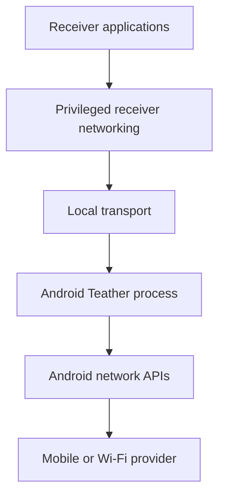

# Threat model

Teather carries arbitrary receiver traffic and changes receiver networking state.
Even as a personal project, it must be designed as security-sensitive software.

## Assets

- Confidentiality and integrity of relayed traffic.
- Android host identity and authorized-receiver records.
- Receiver identity and tunnel keys.
- Availability of the phone's upstream connection.
- Integrity of Linux routes, DNS, firewall state, and privileged helper.
- User privacy, including destinations and usage patterns.
- Android device integrity required by Google Wallet/Pay and other applications.

## Trust boundaries

- Receiver applications may be buggy or hostile.
- The local USB/Wi-Fi/Bluetooth link is not inherently trusted.
- Android and receiver operating systems are trusted within their documented
  security models.
- The upstream provider and Internet are untrusted transports.
- Teather does not decrypt application TLS and must not attempt to do so.

## Primary threats and mitigations

### Unauthorized relay use

**Threat:** A nearby or LAN peer discovers Teather and consumes the phone's data.

**Mitigations:**

- Bind P0 only to the ADB-forwarded local endpoint.
- Require explicit pairing before shared-link use.
- Give every receiver a distinct revocable identity.
- Apply connection, flow, and byte-rate limits where practical.
- Show active receiver count and identity on Android.

### Traffic observation or modification on the local link

**Threat:** A local peer observes or alters relay traffic despite Wi-Fi/Bluetooth
link security.

**Mitigations:**

- Use authenticated encryption at the Teather session layer.
- Prefer established cryptographic protocols and libraries.
- Never design custom cryptographic primitives.
- Bind identity to the pairing confirmation.

ADB P0 relies on ADB host authorization and physical control but should not be
mistaken for the final shared-link security model.

### Malicious protocol input

**Threat:** A receiver sends malformed frames, oversized requests, excessive
flows, or pathological fragmentation to crash or exhaust the phone.

**Mitigations:**

- Strict parsing and bounded allocations.
- Per-receiver flow and memory limits.
- Timeouts and backpressure.
- Fuzz protocol parsers once stable.
- Avoid exposing unsafe native parsers without containment and tests.

### Receiver route or DNS damage

**Threat:** Teather exits after changing networking state, leaving the receiver
offline or leaking traffic through an unintended path.

**Mitigations:**

- Snapshot relevant state before mutation.
- Tag and journal only Teather-owned changes.
- Idempotent cleanup on exit and next start.
- Network-namespace/VM tests before host-level mutation.
- Emergency diagnostic and restoration command.
- Never delete unrelated routes or firewall rules.

### Privilege escalation on Linux

**Threat:** A parser, GUI, or receiver-controlled value reaches a privileged shell
or network-management operation.

**Mitigations:**

- Keep UI and protocol parsing unprivileged.
- Introduce a minimal helper with a fixed typed API.
- Validate interface names, addresses, table IDs, and operations against strict
  allowlists.
- Never interpolate untrusted values into shell commands.
- No wildcard passwordless sudo policy.

### Sensitive logging

**Threat:** Logs, captures, or issue attachments reveal browsing destinations,
keys, subscriber information, or device identifiers.

**Mitigations:**

- Redact destinations by default.
- Never log payloads or private keys.
- Make verbose diagnostics explicit, time-limited, and visibly enabled.
- Provide a redacted diagnostics exporter rather than asking for whole log trees.
- Ignore captures and local secrets in Git.

### Upstream leakage or fallback

**Threat:** Traffic uses an upstream other than the one selected in Teather.

**Mitigations:**

- Bind Android outbound sockets explicitly when strict selection is enabled.
- Report network loss instead of silently falling back unless the user selected
  automatic fallback.
- Test IPv4, IPv6, and DNS independently.
- Expose the actual active upstream in status.

### Device-integrity compromise

**Threat:** Implementation shortcuts require root, bootloader changes, hidden APIs,
or integrity bypasses that interfere with payment and security-sensitive apps.

**Mitigations:**

- Enforce D-001.
- Use documented Android APIs and ordinary app permissions.
- Treat root-only contributions as out of baseline scope.
- Review dependencies that bundle privileged installers or system modifications.

## Privacy posture

The intended baseline has:

- no account;
- no cloud control plane;
- no analytics;
- no remote telemetry;
- no browsing-history database;
- local-only pairing and configuration.

Session totals and coarse diagnostics may be stored locally. Destination-level
history requires a separate explicit decision and privacy review.

## Out of scope assumptions

Teather cannot protect against:

- a compromised Android or receiver operating system;
- malicious applications already able to inspect another application's memory;
- observation performed by the mobile provider or destination service;
- application-layer tracking;
- physical access to unlocked devices;
- service-plan enforcement outside the application's control.

## Required review triggers

Update this threat model before adding:

- a listener reachable from Wi-Fi, Bluetooth, or LAN;
- persistent identity keys;
- a custom binary protocol;
- native packet-processing code;
- a Linux privileged helper;
- multiple receivers;
- remote access or cloud services;
- diagnostic packet capture;
- automatic provider-specific behavior.

